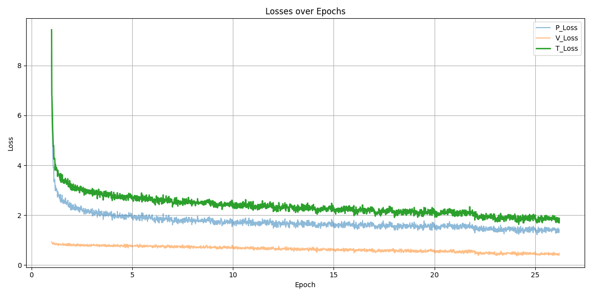
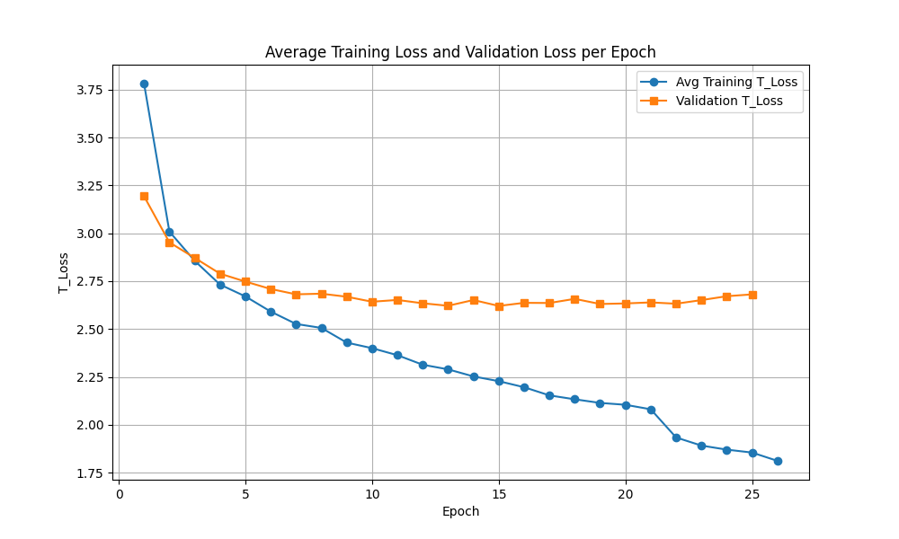

# Talbotbot v1.1

## Overview

The proof of concept version. This was a small scale model training on a small dataset with no MCTS integration. This model had the following properties:

- **Network:**  10 residual blocks
- **Data:** 5 million lichess positions from the elite DB. Positions were stored in hdf5 file containing:
  - **Input:** 18 feature planes representing the board state
  - **Policy head:** one hot encoded move that was played
  - **Value head:** game outcome (win/loss/draw) as 1, 0, -1 from perspective of player

## Training

The hyper paramters used for this iteration are below. No regularization was used

### Hyperparameters
- **Batch size:**  512
- **Learning rate:**  1e-3
- **Scheduler:**  ReduceLROnPlateau
- **Optimizer:**  Adam
- **Training set size:**  2%

## Training loss

Here is the plot showing the training loss per epoch:

- **V_Loss:**  The value head loss, representing the MSE in predicting the game outcome as a continuous value between -1 and 1 (win/loss/draw). Since it’s a regression on a single scalar, the loss values tend to be smaller.
- **P_Loss:**  The policy head loss, which measures the cross-entropy error in predicting the probability distribution over possible moves. This loss is typically higher because it compares a one-hot encoded target move against the predicted probability distribution using cross-entropy.
- **T_Loss:**  The total training loss, calculated as the sum of V_Loss and P_Loss. This combined loss is used to evaluate and select the best model.

Here is the plot comparing the average training loss per epoch, with the average validation loss per epoch:

Due to the small model size, relatively small dataset, and no regularization, we see rapid overfitting. Best model is ~epoch 10.

## Evaluation

- Did not include search algorithm, meaning the highest probability move from the policy head is the one played.
- Played well in opening, but failed to see short tactical lines.
- Value head varies wildly. Makes sense, as we trained on the outcome of the game as opposed to present valuation.