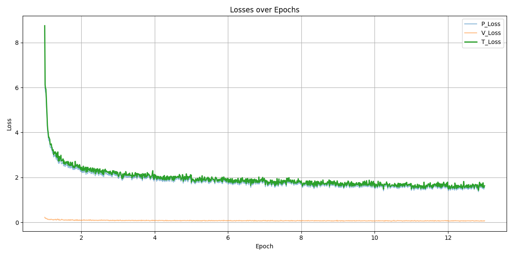
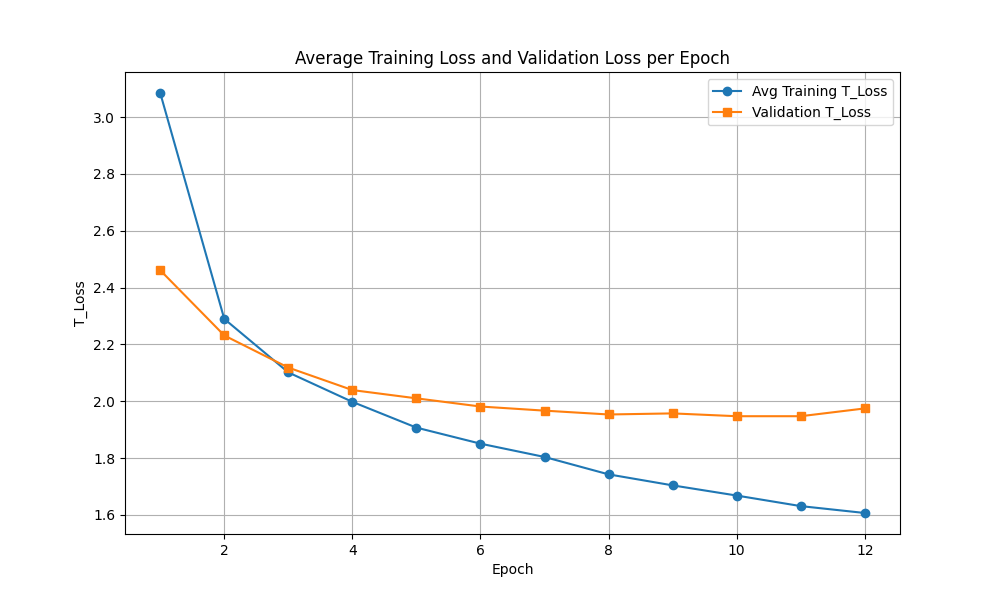

# Talbotbot v1.3

## Overview

This version built upon v1.1 by incorporating higher-quality data and increasing model depth. The primary objective of this iteration was to enable Monte Carlo Tree Search (MCTS) integration, which required a more accurate value head. To achieve this, the value target was changed from the final game result to a short Stockfish evaluation.

- **Network:** 16 residual blocks  
- **Training data:** 5 million Lichess positions from the Elite Database, filtered to games with players rated above 2600 Elo  
- **Input:** A tensor of shape **18 × 8 × 8** representing the board state, composed of the following feature planes:
    - 6 planes for white pieces: One binary plane per piece type (pawn, knight, bishop, rook, queen, king); `1` indicates presence of the piece, `0` indicates absence.
    - 6 planes for black pieces: Same format as above, for black's pieces.
    - 1 plane for the current turn: All `1`s if it's white to move, all `0`s if it's black.
    - 4 planes for castling rights: Kingside and queenside availability for both white and black; each plane is filled with `1`s if castling is available, otherwise `0`s.
    - 1 plane for en passant: A binary mask where only the valid en passant file is marked with `1`s (if applicable).
- **Policy head:** Predicts the move played, represented as a one-hot encoded vector  
- **Value head:** Predicts the 0.01s Stockfish evaluation for the position, normalized to the range `[-1, 1]` using the `tanh` function

## Training

The following hyperparameters were used (same as in v1.1). No regularization was applied:

### Hyperparameters

- **Batch size:** 512  
- **Learning rate:** 1e-3  
- **Scheduler:** ReduceLROnPlateau  
- **Optimizer:** Adam  
- **Training set size:** 2%

## Training loss

Below is the plot of training loss per epoch:

- **V_Loss:** The value head loss, calculated as mean squared error between the predicted and true normalized Stockfish evaluations. Because the model is learning a bounded evaluation function, this loss tends to be low and more stable than game outcome prediction.
- **P_Loss:** The policy head loss, computed via cross-entropy between the predicted move distribution and the one-hot encoded actual move. This typically remains the dominant component of total loss.
- **T_Loss:** The total training loss, calculated as the sum of V_Loss and P_Loss. This combined loss is used for checkpoint selection.

The value loss in this model is significantly lower, suggesting that using a short-term engine evaluation is easier for the network to learn than the final game result. The best model (around epoch 7) achieved a validation value loss of **0.0790**, corresponding to an average error of approximately **101 centipawns**. Most of the remaining loss comes from the policy head.

The following plot compares average training and validation loss per epoch:

We observe similar overfitting behavior to v1.1, though this model trains faster and achieves lower value head error.

## Evaluation

- An MCTS was integrated for this version. The initial policy head outputs were used to bias the search, and the value head guided the evaluation of child nodes in the tree.
- Performance was improved over v1.1, particularly in positional understanding, but tactical strength remained weak—likely due to limited data and model capacity.
