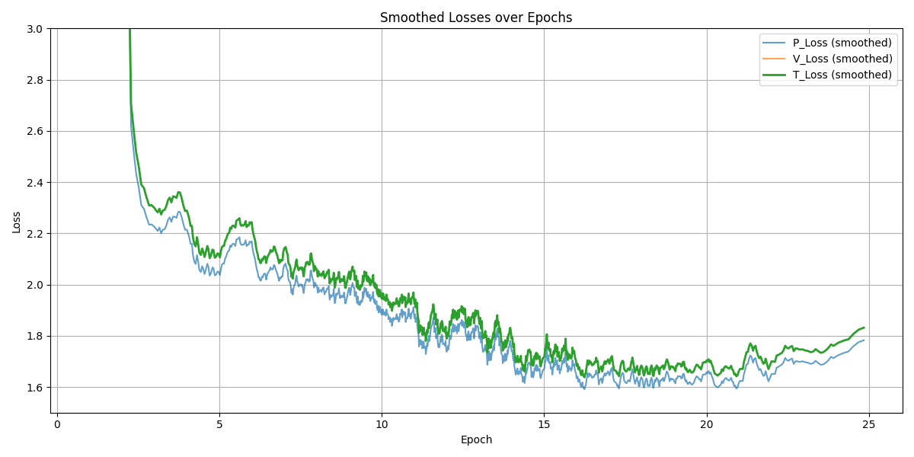
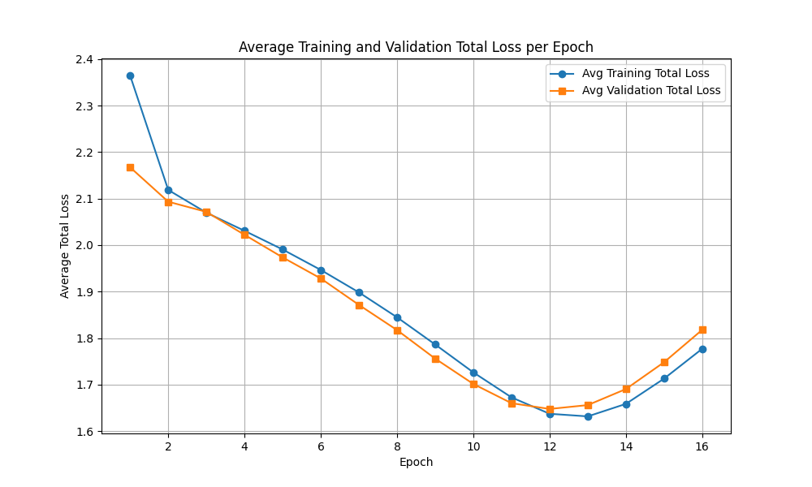

# Talbotbot v1.3

## Overview

This version significantly increased both data quality and model capacity. With 20 residual blocks, the architecture was now sufficiently deep to capture complex patterns, so the focus shifted to scaling the dataset and improving data throughput. A custom multi-threaded data pipeline was implemented to parallelize Stockfish evaluations, enabling up to 8 concurrent instances—solving the bottleneck from the previous version. Each PGN file (one per grandmaster) was processed into an individual HDF5 file and later merged, a process that took several days.

- **Network:** 20 residual blocks  
- **Training data:**  
  - 5 million Lichess positions from the Elite Database (filtered to >2600 Elo)  
  - 39,267,090 positions from over a century of grandmaster games  
- **Input:** A tensor of shape **18 × 8 × 8** representing the board state, composed of the following feature planes:
    - 6 planes for white pieces: One binary plane per piece type (pawn, knight, bishop, rook, queen, king); `1` indicates presence of the piece, `0` indicates absence.
    - 6 planes for black pieces: Same format as above, for black's pieces.
    - 1 plane for the current turn: All `1`s if it's white to move, all `0`s if it's black.
    - 4 planes for castling rights: Kingside and queenside availability for both white and black; each plane is filled with `1`s if castling is available, otherwise `0`s.
    - 1 plane for en passant: A binary mask where only the valid en passant file is marked with `1`s (if applicable).
- **Policy head:** Predicts the move played using a one-hot encoded target  
- **Value head:** Predicts Stockfish’s 0.01s evaluation for the position, normalized to `[-1, 1]` via `tanh`

## Training

For this iteration, a cosine annealing scheduler was introduced along with L2 regularization to improve generalization.

### Hyperparameters

- **Batch size:** 512  
- **Learning rate:** 1e-3 (maximum), 1e-4 (minimum)  
- **Scheduler:** CosineAnnealingLR  
- **Optimizer:** Adam  
- **Regularization:** L2 regularization with weight decay = 1e-4  
- **Training set size:** 2%

## Training loss

Below is the plot of the training loss per epoch:

- **V_Loss:** Value head loss (MSE between predicted and true Stockfish evaluations). It is not clearly visible in the plot due to scale, as it remains relatively low throughout training.
- **P_Loss:** Policy head loss, calculated via cross-entropy between the predicted move distribution and the one-hot encoded target move. As in earlier versions, this is the dominant component of the loss.
- **T_Loss:** Total loss (sum of V_Loss and P_Loss), used to evaluate and select the best model checkpoints.

This plot shows the smoothed loss curve. The policy loss remains the primary contributor, consistent with earlier experiments.

Here is the comparison of average training and validation loss per epoch:

Overfitting begins around epochs 11–12. However, with the introduction of L2 regularization and a more diverse dataset, the model generalizes better than earlier versions.

## Evaluation

- **Positional Play:** Significantly improved over previous versions. The model demonstrates strong understanding of strategic concepts and long-term planning.
- **Tactical Weaknesses:** Still struggles with short tactical combinations (2–3 move sequences) and in-between moves. This is likely due to the dataset—grandmasters rarely play simple tactics, as these are often avoided or neutralized before they appear on the board.
- **Endgames:** Underperforms in forced mate scenarios. Since high-level games rarely play out to checkmate (resignations occur earlier), the model has limited exposure to such patterns.
- **Repetition Handling:** The model occasionally repeats positions in winning scenarios. This is due to a lack of repetition tracking in the input tensor, which currently has no channel encoding past move history.