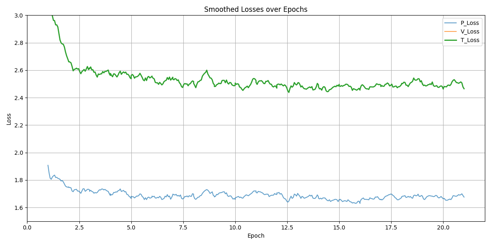

# Talbotbot v1.4

## Overview

Given the long training time of the previous model, this iteration focused on fine-tuning rather than full retraining. The goal was to improve tactical awareness without losing the strong positional play already achieved. To complement this, the Monte Carlo Tree Search (MCTS) was significantly optimized—enabling deeper searches that help compensate for tactical weaknesses in the raw policy predictions.

- **Network:** 20 residual blocks  
- **Training data:**  
  - 2 million GM positions (to prevent catastrophic forgetting)  
  - 2 million Lichess tactical positions  
- **Input:** A tensor of shape **18 × 8 × 8** representing the board state, composed of the following feature planes:
    - 6 planes for white pieces: One binary plane per piece type (pawn, knight, bishop, rook, queen, king); `1` indicates presence of the piece, `0` indicates absence.
    - 6 planes for black pieces: Same format as above, for black's pieces.
    - 1 plane for the current turn: All `1`s if it's white to move, all `0`s if it's black.
    - 4 planes for castling rights: Kingside and queenside availability for both white and black; each plane is filled with `1`s if castling is available, otherwise `0`s.
    - 1 plane for en passant: A binary mask where only the valid en passant file is marked with `1`s (if applicable).
- **Policy head:** One-hot encoded move that was played  
- **Value head:** Stockfish 0.01s evaluation normalized to `[-1, 1]` using `tanh`

## Training

This was a fine-tuning pass rather than a full training cycle, so the learning rate was significantly reduced to avoid overwriting previous knowledge.

### Hyperparameters

- **Batch size:** 512  
- **Learning rate:** 1e-7 (maximum), 1e-9 (minimum)  
- **Scheduler:** CosineAnnealingLR  
- **Optimizer:** Adam  
- **Regularization:** L2 regularization with weight decay = 1e-4  
- **Training set size:** 2%

## Training loss

Below is the plot of the training loss per epoch:

This plot shows the smoothed loss curves. As expected with such a low learning rate, no significant shifts in total loss are observed. The **V_Loss** has been scaled proportionally to match the **P_Loss**, which explains the larger visual difference compared to previous iterations.

Here is the comparison of average training and validation loss per epoch:

Convergence remains slow due to the extremely low learning rate. Nevertheless, the total loss remains stable, suggesting that the model's core behavior has been preserved.

## Evaluation

- Behavior is nearly identical to v1.3: strong in positional play, but still struggles tactically in short sequences.  
- Successfully integrated with the Lichess API and achieved a playing strength of approximately **1600 Elo**.  