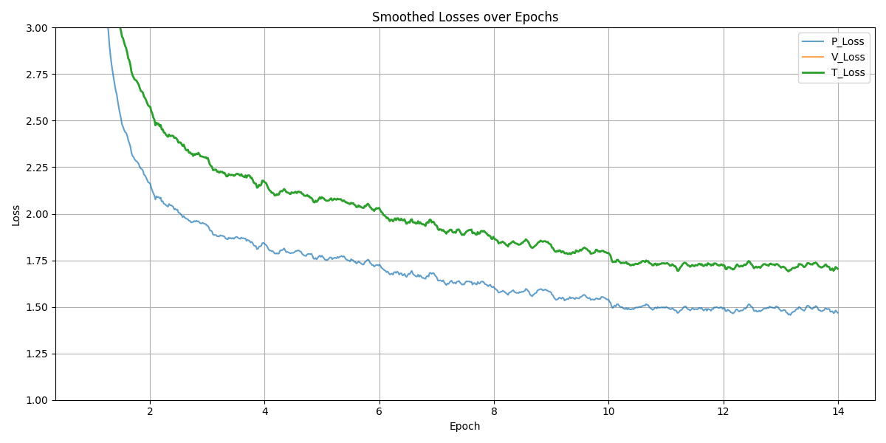
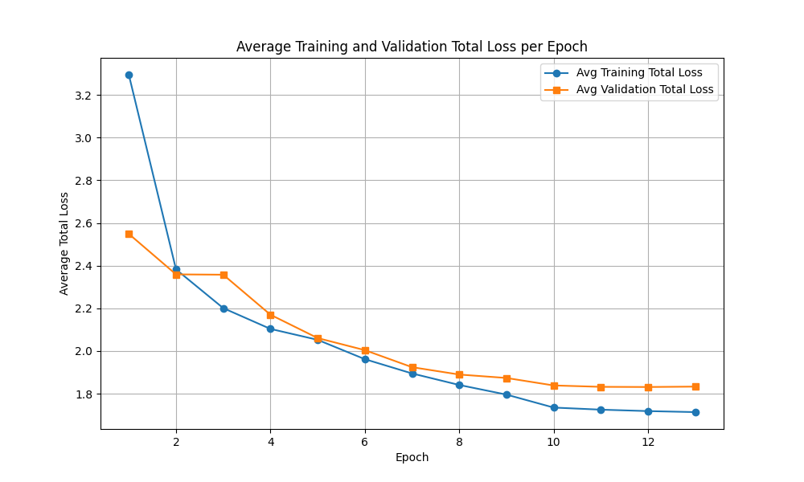

# Talbotbot v1.5

## Overview

This was intended to be the final supervised iteration, with a focus on addressing limitations observed in earlier models—specifically, weaknesses in tactical and endgame positions. To that end, the dataset was significantly expanded and diversified across three sources, and synthetic data was generated to improve endgame understanding. The input representation was also enhanced: positions are now flipped to always represent the side to move, and historical context is included by encoding previous board states and repetition counters.

- **Network:** 20 residual blocks  
- **Training data:**
  - **20M grandmaster positions** (filtered to games with 30+ moves to avoid early draws)
  - **5M Lichess Masters positions** (2600+ Elo, 30+ moves)
  - **2M Lichess tactical positions**, filtered to contain tactics ≥4 moves. The final 4 moves are prepended to the input to provide sequence context.
  - **2M synthetic endgame positions** (random samples from 3–7 piece endgames). Each position is replayed for 4 moves to generate realistic previous states.
- **Input:** A tensor of shape **18 × 8 × 8** representing the board state, composed of the following feature planes:
  - 6 planes for white pieces: One binary plane per piece type (pawn, knight, bishop, rook, queen, king); `1` indicates presence, `0` absence.
  - 6 planes for black pieces: Same format as above, for black's pieces.
  - 1 plane for the current turn: All `1`s if it's white to move, all `0`s if black.
  - 4 planes for castling rights: Kingside and queenside availability for both white and black; each plane is filled with `1`s if castling is available, otherwise `0`s.
  - 1 plane for en passant: A binary mask where only the valid en passant file is marked with `1`s (if applicable).
  - **12 × 4 planes** representing the board state history from the previous 4 positions.
  - 2 planes for repetition counters: Encodes whether the current position has been seen once or twice in the game.
- **Policy head:** One-hot encoded move that was played. For synthetic endgames, this corresponds to Stockfish’s principal variation.
- **Value head:** 0.02s Stockfish evaluation normalized to `[-1, 1]` using `tanh`.

## Training

The hyperparameters used for this iteration are shown below. Learning rate was reduced for fine-tuning.

### Hyperparameters

- **Batch size:** 512  
- **Learning rate:** `1e-5` (max), `1e-6` (min)  
- **Scheduler:** CosineAnnealingLR  
- **Optimizer:** AdamW  
- **Regularization:**  
  - L2 regularization: `1e-4`  
  - Dropout: `0.1` on residual blocks >10, `0.25` on fully connected heads  
- **Training set size:** 4%

## Training Loss

Here is the plot showing the training loss per epoch:

This plot is smoothed. With added regularization and a more diverse dataset, the model trains more stably than earlier versions.

Here is the comparison of average training loss per epoch with average validation loss per epoch:

Convergence is slower than earlier iterations, but overfitting is minimal, suggesting improved generalization.

## Evaluation

- Despite similar loss levels to v1.3/v1.4, the model performs significantly better due to higher-quality and more varied data.
- **Endgames:** Can execute basic mating sequences (e.g., king + rook mate) and convert winning positions more reliably.
- **Tactics:** Stronger than prior versions. Still capable of missing subtle blunders, but much less frequently.
- Often sacrifices material for longer-term compensation—more "human-like" in evaluation.
- Integrated with Lichess API. Achieved an Elo of ~1700. Accounting for rating deflation and sandbagging, true strength likely around 1800–1900 human Elo.